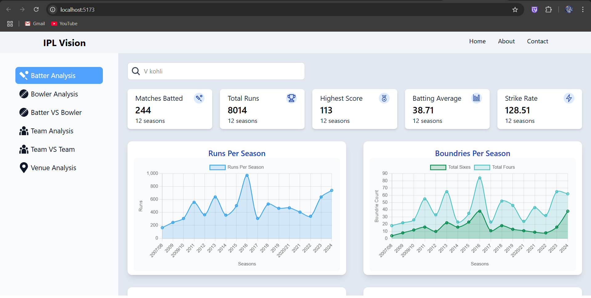
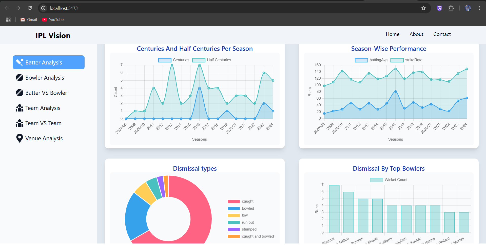
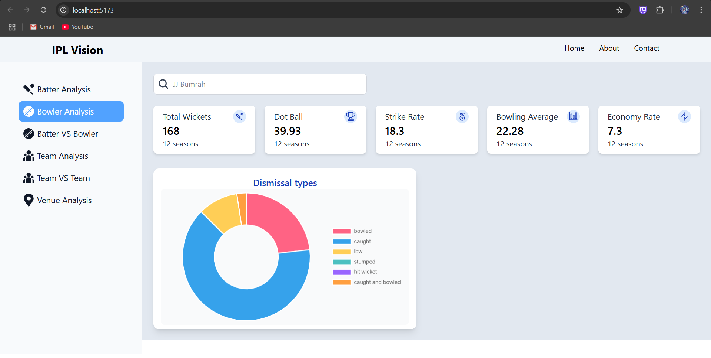
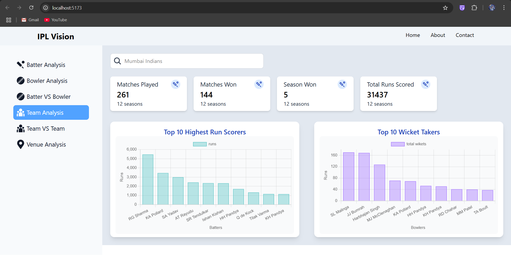
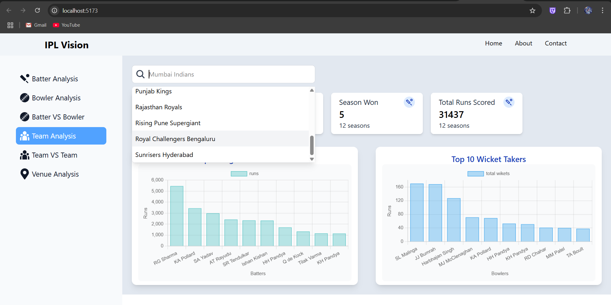

# 🏏 IPL Vision – Cricket Analytics Dashboard

**IPL Vision** is a full-stack web-based analytics platform that allows users to explore and analyze the performance of IPL teams and players using real match data. It provides season-wise, player-wise, and team-wise statistics through an interactive and visually appealing dashboard. It offers detailed stats, dynamic filtering, and rich visualizations to deliver insights into batting and bowling trends across seasons.

---

## Key Features & Functionalities:
### 🔎 1. Batter Analysis Module
- Allows users to analyze a batsman’s performance across all seasons.
- Shows total runs, season-wise run breakdown, strike rate, average, boundaries, high scores, and performance trends.
- Visualized with line charts, bar graphs, and pie charts for better insight.
--

--

--

### 🎯 2. Bowler Analysis Module
- Displays stats like total wickets, economy rate, strike rate, best bowling figures, and season-wise performance.
- Highlights key trends such as improvements over seasons or performances against specific teams.
--

--
### 🏏 3. Team Analysis Module
- Provides season-by-season breakdown of each IPL team’s wins, losses, points, and net run rate.
- Shows top-performing players from the team (both batting and bowling).
- Head-to-head analysis with other teams to find strongest and weakest matchups.
- Visual stats like pie charts for win-loss ratios and bar graphs for seasonal standings.
--

--
### 📊 4. Interactive Visualizations
- Data is not just shown but represented through beautiful and dynamic charts using Chart.js.
- Includes line graphs for performance over time, pie charts for proportions, and bar charts for rankings.
--
### 🔄 5. Real-Time Filtering & Search
- Users can search for players or teams and instantly see stats without refreshing.
- Dynamic filters allow choosing seasons, match types, or specific opponents.
--

--
### ⚙️ 6. Data Handling & Backend
- Data is cleaned, processed, and structured using Pandas for efficient querying and analytics.
- Flask serves as the backend framework, exposing RESTful APIs to handle requests from the frontend.
- APIs are modular: separate routes for batters, bowlers, and teams to keep it scalable and maintainable.

---

## 🛠️ Tech Stack

| Layer        | Technologies Used                          |
|--------------|---------------------------------------------|
| Frontend     | React.js, JavaScript, Tailwind CSS          |
| Backend      | Python, Flask (RESTful API)                 |
| Data Handling| Pandas, IPL CSV datasets                    |
| Charts       | Chart.js                                    |

---

## How It Works

1. The backend (Flask) serves clean APIs for batters, bowlers, and teams.
2. IPL datasets are preprocessed using Pandas to extract stats like averages, wickets, and run rates.
3. The frontend (React.js) fetches data and displays it using Chart.js in a responsive dashboard.
4. Real-time filters and search make data exploration seamless.

---

## 🧰 Setup Instructions

### 1. Clone the Repository
```bash
git clone https://github.com/Roshan-504/IPL-Vision.git
cd IPL-Vision
```

### 2. Setup Backend (Flask API)

```bash
cd backend
pip install -r requirements.txt
flask run
```

### 3. Setup Frontend (React App) Open a new Terminal and Navigate to IPL-Vision Folder

```bash
cd frontend
npm install
npm run dev
```

### 4. Open your browser and navigate to: http://localhost:5173
---
